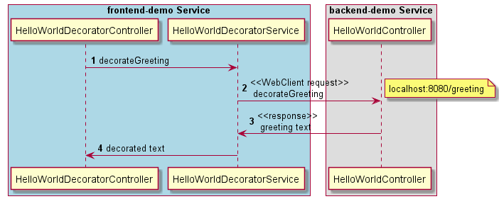
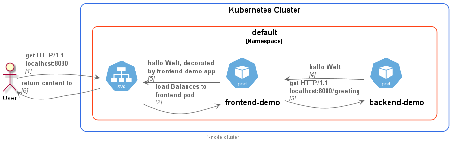

= Frontend Sevice

This is a Spring boot application to test the communication of the pods inside a kubernetes cluster.

== Spring Boot App

The controller provides a REST-API endpoints at **localhost:8080/**.
It calls a service method `decorateGreeting()` which uses WebClient to send a get request to another Spring Boot
app called "backend-demo".

.frontend-demo sequence diagram

== helming

In order to create helm charts for your app, you need to execute the following command in a _helm_ directory of your project:

[helm]
----
helm create frontend-demo
----

The helm charts including deployments and service will be placed in a folder named _frontend-demo_.

In _ci-scripts_ folder we place shell scripts to 1. lint helm charts and 2. install these charts.

The name of the image (here the name of already built frontend-demo image) and the required environment variables for the app
 should be given in the `helm template` commands inside the scripts so that the values would be put inside the tempaled charts.
The important env-variable is the _backend_demo_url_ which indicates the address of the provider pod in the cluster.
The name of the pod (backend-demo) is the DNS name of the pod in the cluster network, therefore
the complete address of the _backend-demo_ pod would be **http://backend-demo.default.svc.cluster.local:8080/greeting** after
this pattern:

`[pod].[namespace].[svc].[localhost]:[port]/[api]`.

At the moment the image (frontend-demo) should be available locally in order to be picked up at the time of installation on the cluster
, but it may be placed in an image repository in further developments.

== kubernetes
Having all the yaml files created by the helm, we need to install them on a cluster. For now we
use an 1-node local cluster using **docker-desktop**.

We can install and use kubernetes CLI **kubectl** in order to communicate with the k8s cluster.

The following illustrates the communication between our services, _frontend-demo_ and _backend-demo_:

.overview of our services on the cluster

After deploying the service on the cluster using deployment scripts on the _ci-scripts_ folder, we can
access our frontend-demo service by this command:

`kubectl port-forward frontend-demo 8080:8080`

Then curl to the service (`curl localhost:8080`) would show use the decorated string using both of our services, which
proves a successful "round-trip".

To delete the pods we could either delete the deployments:

`kubectl delete deployment frontend-demo backend-demo`

or

`helm uninstall frontend-demo backend-demo`

== further ideas to enrich the cluster

* securing/encrypting the communications between pods (service mesh)

* using ConfigMap and Secrets to use inside the apps

* authentication to the backend-demo service to call its APIs

* using a DB outside the cluster

* talking TLS with this DB

